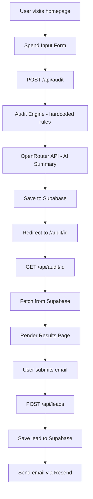

# Architecture

## System Diagram

## Data Flow

1. User fills the spend input form and clicks "Run My Free Audit"
2. Frontend POSTs the AuditInput object to /api/audit
3. The audit engine runs deterministic rules against each tool — no AI involved here
4. OpenRouter API generates a ~100 word personalized summary (fallback to template on failure)
5. Full audit result is saved to Supabase audits table
6. User is redirected to /audit/[id] — a unique public URL
7. The results page fetches the audit from Supabase via GET /api/audit/[id]
8. User optionally submits email — saved to leads table, email sent via Resend

## Stack Choices

- **Next.js 14 App Router + TypeScript** — SSR needed for Open Graph meta tags on shareable URLs. App Router gives us clean file-based API routes co-located with pages.
- **Tailwind CSS** — fastest way to build a clean dark UI without a design system. No runtime overhead.
- **Supabase** — Postgres gives relational integrity between audits and leads. Free tier is generous. REST API works out of the box without an ORM.
- **OpenRouter** — Free access to LLaMA models. Acts as a drop-in for the Anthropic API with graceful fallback.
- **Resend** — Simplest transactional email API. Works in 5 minutes on free tier.
- **Vercel** — Zero-config Next.js deployment. Auto-deploys on push to main.

## Scaling to 10k Audits/Day

- Add a Redis cache (Upstash) for audit results — most users share audits, not create new ones
- Move AI summary generation to a background job queue (Inngest or Trigger.dev) so the POST /api/audit response is instant
- Add a CDN layer for the results pages — they're mostly static after creation
- Upgrade Supabase to Pro for connection pooling (PgBouncer)
- Add rate limiting per IP on the audit endpoint (Upstash Ratelimit)