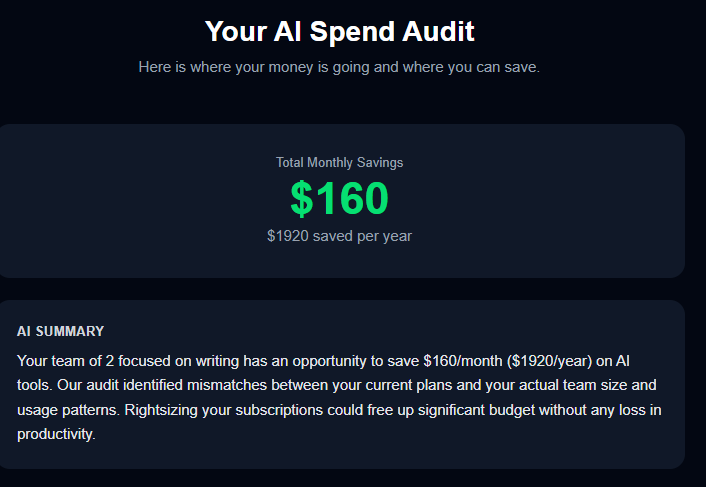
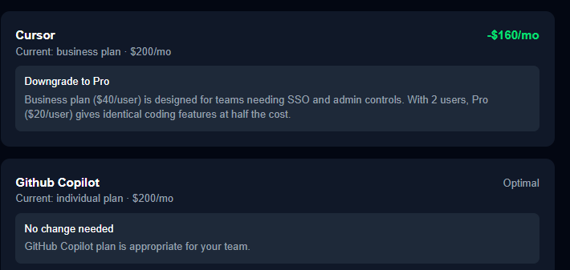
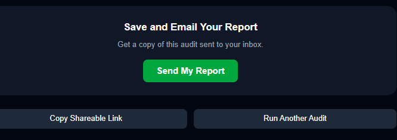

# Credex AI Spend Auditor

A free web app that audits your team's AI tool spending (Cursor, Claude, ChatGPT, Copilot, and more) and shows exactly where you're overspending, what to switch, and how much you'd save monthly and annually.

Built as part of the Credex Web Development Intern Assignment.

## Live URL
https://credex-audit-three.vercel.app/

## Screenshots
### Home Page — Spend Input Form

### Results Page — Audit Results




## Quick Start

### Prerequisites
- Node.js 18+
- npm

### Install & Run Locally
```bash
git clone https://github.com/YOUR_USERNAME/credex-audit.git
cd credex-audit
npm install
cp .env.example .env.local
# fill in your env variables
npm run dev
```

Open [http://localhost:3000](http://localhost:3000)

### Deploy
Push to main branch — Vercel auto-deploys.

## Decisions

1. **Next.js over plain React** — Need SSR for Open Graph tags on shareable audit URLs. Static React can't do that cleanly.
2. **Supabase over Firebase** — Postgres gives us proper relational queries; audit + lead data fits a table structure better than a document store.
3. **Hardcoded audit rules over AI** — Pricing logic must be defensible and deterministic. AI hallucinating a savings number would be worse than no AI at all.
4. **Email captured after audit, never before** — Showing value first increases conversion and respects the user. Gate too early and they leave.
5. **Resend over SES** — SES requires domain verification and AWS setup. Resend works in 5 minutes on free tier, right call for a 7-day build.

## Tech Stack
- Next.js 14 (App Router) + TypeScript
- Tailwind CSS + shadcn/ui
- Supabase (Postgres)
- Anthropic API (claude-sonnet-4-20250514)
- Resend (transactional email)